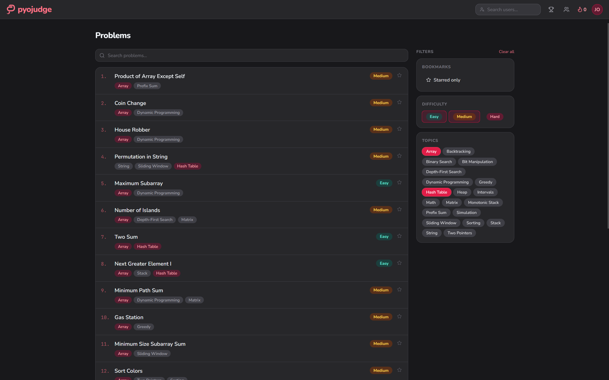
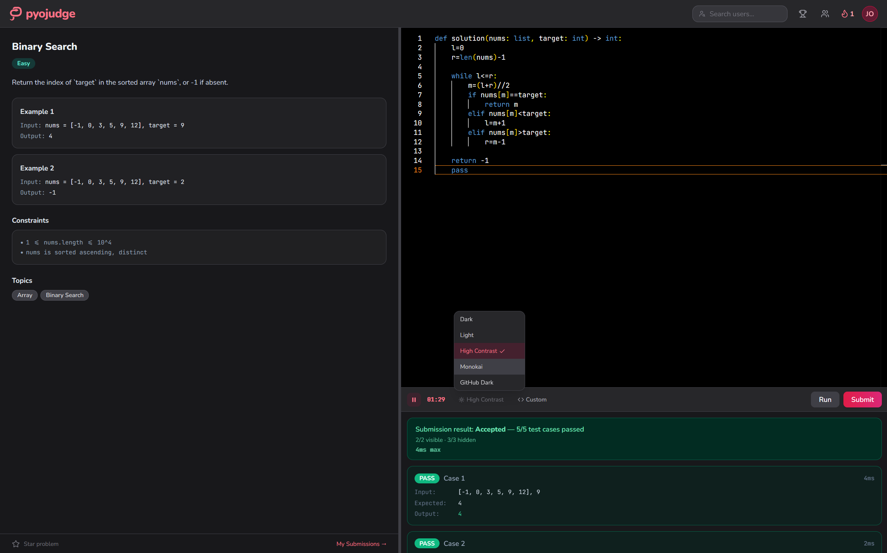
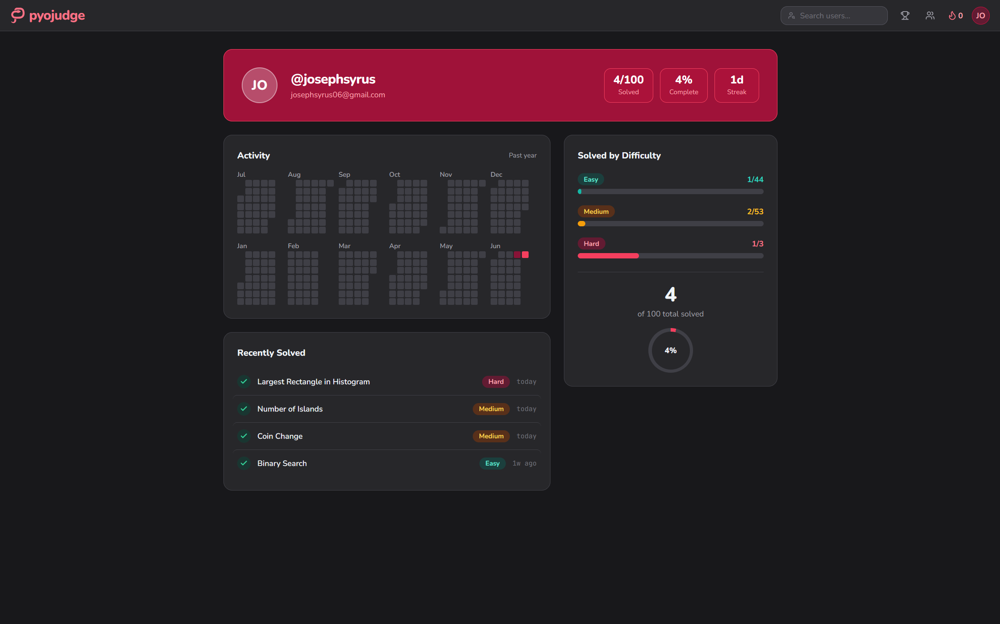
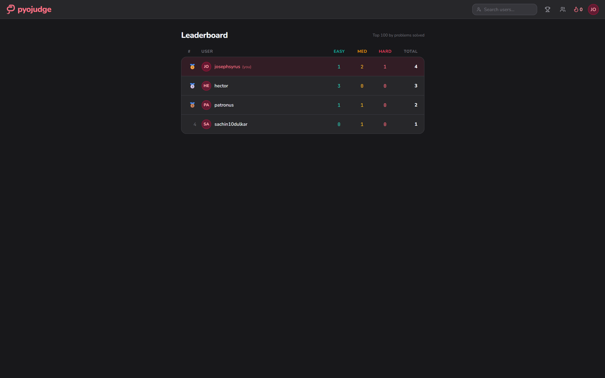
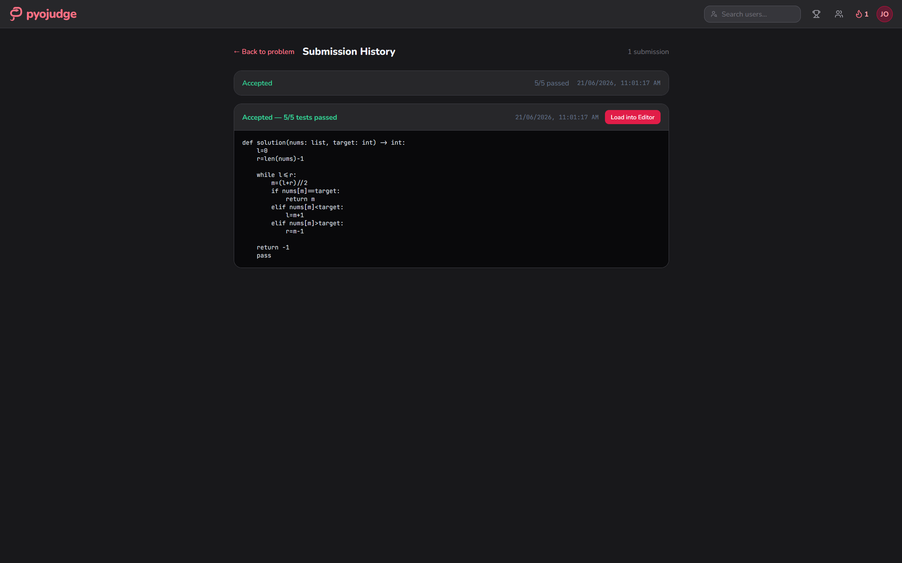
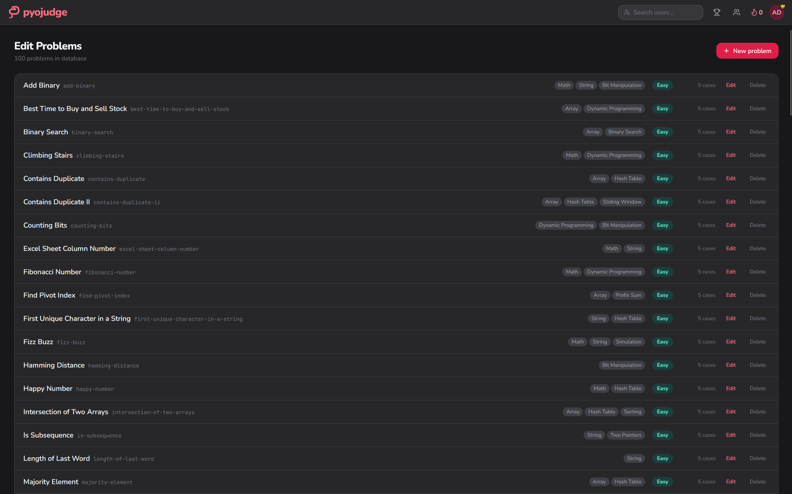

# PyoJudge

PyoJudge is an online judge for Python where code runs entirely in the browser. Users solve coding problems in a Monaco editor, and submissions are executed client-side using Pyodide (CPython compiled to WebAssembly) before being verified against hidden test cases on the server. It supports user profiles, submission history, streaks, leaderboards, and an admin panel for managing problems.

Built as a full-stack TypeScript application with React on the frontend and Node.js/Express on the backend, backed by MongoDB.

Live at [pyojudge.josephsyrus.com](https://pyojudge.josephsyrus.com)

## Screenshots

**Problem list** - browse, search, and filter by difficulty and tags



**Problem view** - split panel with description, Monaco editor, submission results, and editor theme picker



**User profile** - activity heatmap, solved counts by difficulty, and recently solved problems



**Leaderboard** - users ranked by problems solved with a breakdown by difficulty



**Submission history** - past submissions with verdict, code, and a button to reload into the editor



**Admin panel** - manage all problems with tags, difficulty, test case counts, and edit/delete controls



## Features

- **Browser-side execution** - Python code runs in a Pyodide Web Worker with a 5-second timeout. No server-side sandboxing needed.
- **Server-side verification** - After client execution, the server re-validates results against both visible and hidden test cases to prevent cheating.
- **Authentication** - JWT access and refresh tokens with bcrypt password hashing. Refresh tokens are SHA-256 hashed before storage and rotated on each use. Supports GitHub and Google OAuth2.
- **Problems** - Browse, search, and filter problems by difficulty and tags. Each problem has a description, examples, constraints, starter code, and hidden test cases.
- **Code editor** - Monaco Editor with syntax highlighting and theme sync (light/dark).
- **Submission history** - View all past submissions for a problem with verdict, test results, and execution time.
- **User profiles** - Public profiles showing solved problems by difficulty, recent activity, and an activity heatmap.
- **Streaks** - Tracks consecutive days with at least one accepted submission.
- **Leaderboard** - Top 100 users ranked by problems solved, with a breakdown by difficulty.
- **Friends** - Follow other users and view their profiles.
- **Starred problems** - Bookmark problems for later.
- **Admin panel** - Create, edit, and delete problems with full control over test cases, difficulty, and tags.
- **Rate limiting** - Separate rate limits for authentication, submissions, and general API access.
- **Dark/light theme** - Persisted in localStorage, synced with the editor theme.

## Tech Stack

| Layer    | Technology                                |
| -------- | ----------------------------------------- |
| Frontend | React 19, Vite, TailwindCSS, Monaco Editor |
| Backend  | Node.js, Express 5, Mongoose              |
| Database | MongoDB                                   |
| Auth     | JSON Web Tokens, bcrypt, OAuth2           |
| Runtime  | Pyodide (CPython via WebAssembly)         |
| Testing  | Vitest, supertest, mongodb-memory-server  |
| Icons    | Lucide React                              |

## Database Schema

The application uses the following collections:

- `users` - account credentials, OAuth IDs, role, starred problems, friends list, and an array of hashed refresh tokens
- `problems` - title, slug, difficulty, description, examples, constraints, starter code, function name, tags, and test cases (some marked hidden)
- `submissions` - references to user and problem, submitted code, verdict, per-test results with execution times, and a timestamp

An index on `(userId, problemId, submittedAt)` supports efficient submission history queries.

## API Overview

All endpoints are prefixed with `/api`. Routes marked with (auth) require a valid JWT in the `Authorization` header. Routes marked with (admin) additionally require the `admin` role.

**Auth**

- `POST /api/auth/register` - create a new account
- `POST /api/auth/login` - log in and receive tokens
- `POST /api/auth/refresh` - refresh the access token via cookie
- `POST /api/auth/logout` - invalidate the current refresh token
- `GET /api/auth/github` - begin GitHub OAuth flow
- `GET /api/auth/github/callback` - GitHub OAuth callback
- `GET /api/auth/google` - begin Google OAuth flow
- `GET /api/auth/google/callback` - Google OAuth callback

**Problems**

- `GET /api/problems` - list problems with pagination, search, difficulty, and tag filters
- `GET /api/problems/tags` - list all available tags
- `GET /api/problems/:slug` - get problem details (hidden test case outputs are excluded)

**Submissions**

- `POST /api/submissions` (auth) - submit a solution with client-side test results for server verification
- `GET /api/submissions/problem/:slug` (auth) - submission history for a problem
- `GET /api/submissions/me/streak` (auth) - current solving streak in days
- `GET /api/submissions/me/stats` (auth) - solved counts by difficulty, recent solves, activity heatmap
- `GET /api/submissions/:id` (auth) - individual submission details

**Users**

- `GET /api/users/search?q=` - search users by username
- `GET /api/users/me/starred` (auth) - list starred problems
- `GET /api/users/me/friends` (auth) - list friends
- `POST /api/users/star/:slug` (auth) - toggle star on a problem
- `POST /api/users/friends/:username` (auth) - toggle friend status
- `GET /api/users/:username` - public profile

**Leaderboard**

- `GET /api/leaderboard` - top 100 users by problems solved

**Admin**

- `GET /api/admin/problems` (admin) - list all problems with full details
- `POST /api/admin/problems` (admin) - create a problem
- `PUT /api/admin/problems/:slug` (admin) - update a problem
- `DELETE /api/admin/problems/:slug` (admin) - delete a problem

## Project Structure

```
pyojudge/
  client/
    src/
      api/            # axios instance with auth interceptor and silent refresh
      components/
        auth/         # login and register forms
        editor/       # Monaco code editor with theme sync
        navbar/       # navigation bar, user menu, search
        problem/      # problem description, split panel, difficulty badge
        results/      # test result display
      contexts/       # AuthContext (tokens, user state), ThemeContext (dark/light)
      hooks/          # usePyodideWorker, useKeyboardShortcut, useStreak
      pages/          # route-level components (problem list, problem, profile, leaderboard, admin)
      workers/        # Pyodide Web Worker for sandboxed Python execution
      types/          # shared TypeScript type definitions
      utils/          # output normalization
  server/
    src/
      config/         # MongoDB connection
      middleware/     # JWT auth, security headers
      models/         # Mongoose schemas (User, Problem, Submission)
      routes/         # Express route handlers
      seed/           # database seeding with sample problems
      services/       # token service (JWT creation, rotation, validation)
      utils/          # output normalization
```

## Getting Started

### Prerequisites

- Node.js (v18 or higher)
- A MongoDB database (local or hosted, e.g. MongoDB Atlas)

### Setup

1. Clone the repository

```
git clone https://github.com/josephsyrus/pyojudge.git
cd pyojudge
```

2. Set up the backend

```
cd server
npm install
```

Create a `.env` file in the `server/` directory:

```
PORT=3000
MONGODB_URI=your_mongodb_connection_string
JWT_ACCESS_SECRET=your_access_token_secret
JWT_REFRESH_SECRET=your_refresh_token_secret
ACCESS_TOKEN_EXPIRY=15m
REFRESH_TOKEN_EXPIRY=7d
CLIENT_ORIGIN=http://localhost:5173
NODE_ENV=development
```

For OAuth (optional):

```
GITHUB_CLIENT_ID=your_github_client_id
GITHUB_CLIENT_SECRET=your_github_client_secret
GITHUB_CALLBACK_URL=http://localhost:3000/api/auth/github/callback
GOOGLE_CLIENT_ID=your_google_client_id
GOOGLE_CLIENT_SECRET=your_google_client_secret
GOOGLE_CALLBACK_URL=http://localhost:3000/api/auth/google/callback
```

Seed the database with sample problems, then start the server:

```
npm run seed
npm run dev
```

3. Set up the frontend

```
cd client
npm install
```

Create a `.env` file in the `client/` directory:

```
VITE_API_URL=http://localhost:3000/api
```

Start the dev server:

```
npm run dev
```

The app will be available at `http://localhost:5173`.
